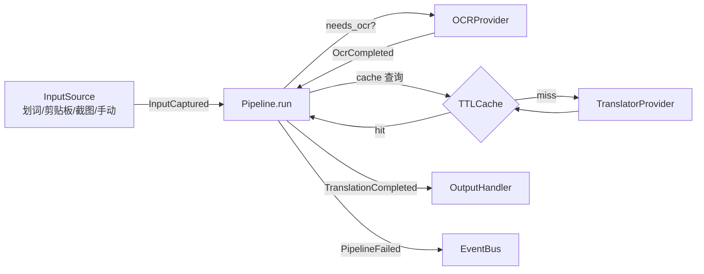

# 架构设计

## 目标

从 0 构建 Bob/Pot 类产品的**核心骨架**。约束:

1. **UI 无关** — 核心包不 import 任何 GUI 库,桌面层通过接口接入
2. **服务插件化** — 翻译/OCR 服务按统一接口注册,可增可换
3. **事件驱动** — 管线各阶段通过 EventBus 解耦,UI 订阅事件即可
4. **配置分层** — 默认值 → 用户 TOML → 环境变量,密钥不落盘

## 数据流

一次 `run()` 的完整流程:

1. **捕获**:`text`/`image` 参数直接使用;否则按 `action.input_source`
   名称从 `InputSourceRegistry` 取输入源
2. **OCR**(可选):`needs_ocr=True` 时调 OCR provider,文本回填
3. **翻译**:查 TTL 缓存 → 未命中则调 Translator provider,
   结果写入缓存(从缓存命中时 `from_cache=True`)
4. **呈现**:`TranslationCompleted` 事件 + 结果分发到所有
   OutputHandler(`only=` 可指定单个)

任何阶段异常 → 发布 `PipelineFailed`(含 action 名)后重新抛出。
订阅方(UI)可据此弹错误提示。

## 模块地图

| 模块 | 职责 | 关键类型 |
|---|---|---|
| `core/events.py` | 同步发布/订阅,处理器错误隔离 | `EventBus`, 4 个 Event |
| `core/registry.py` | 泛型注册表,线程安全 | `ServiceRegistry[T]` |
| `core/pipeline.py` | 动作编排,缓存,降级 | `Pipeline`, `PipelineAction` |
| `models/` | 不可变数据契约(frozen) | `TranslationRequest/Result`, `OCRRequest/Result`, `ImageSource`, `Lang` |
| `providers/base.py` | 服务接口 | `BaseTranslator`, `BaseOCR`, `ProviderMeta` |
| `inputs/base.py` | 输入源接口 | `InputSource`, `InputPayload`, `InputSourceRegistry` |
| `outputs/base.py` | 呈现接口 | `OutputHandler`, `OutputHub` |
| `config/` | 分层配置 | `AppConfig`, `load_config()` |
| `utils/` | 横切能力 | `RetryPolicy`, `RateLimiter`, `TTLCache`, `HttpClient` |

## 关键决策

- **Provider 元数据**:`ProviderMeta(name, version, capabilities)` 声明在
  类属性上,注册即自描述,便于将来做能力发现(`supports("ocr")`)
- **缓存键**:`f"{provider}|{target_lang}|{text}"` — provider 不同互不污染
- **错误层次**:`ProviderError` 基类 → `NotAvailable / QuotaExceeded /
  NetworkError / HttpError`,UI 层按类型区分提示语
- **线程模型**:EventBus/Registry/Cache 带锁,线程安全;Pipeline 本身无状态,
  每次 `run()` 独立 — 桌面层可直接在全局快捷键线程里调用
- **同步管线**:首版全同步(调用阻塞、事件同步派发),简单可测;
  流式响应走 `HttpClient.stream_sse`,由 provider 自行消费

## 边界(本框架不做)

- 不渲染任何 UI(交给 OutputHandler)
- 不内置任何付费/远程服务(交给 provider 插件)
- 不做平台自动化(selection/screenshot 留接口,第二阶段实现)
