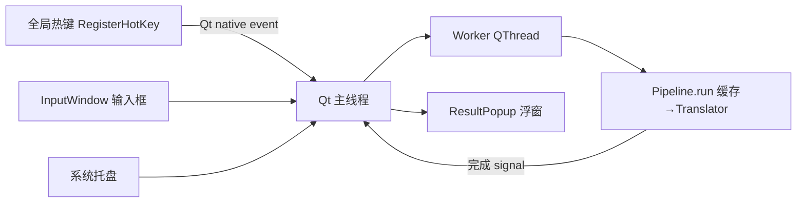

# verba 桌面化(第二阶段):Windows 划词 + 输入翻译 设计

日期:2026-08-01
状态:已批准(2026-08-01 会话确认)

## 背景

`verba` 第一阶段已完成:UI 无关的插件框架(EventBus、Pipeline、
ServiceRegistry、InputSource/OutputHandler 抽象、分层配置),24 测试全绿、
mypy strict 通过。本阶段按 roadmap 第二阶段落地 Windows 桌面层。

## 目标(范围)

复刻 Bob/Pot 类翻译工具在 **Windows** 上的两个核心功能:

1. **划词翻译**:全局热键 → 模拟复制选中文本 → 翻译 → 浮窗显示结果
2. **输入翻译**:全局热键弹输入窗 → 手动输入 → 翻译 → 结果浮窗显示

Bob 风格浮窗:无边框、置顶、圆角、跟随鼠标/输入窗、点击复制、
hover 操作按钮、失去焦点自动关闭。

## 范围外(明确不做,接口预留)

- 截图 OCR 翻译(第三阶段)
- TTS 朗读
- 翻译历史记录
- PyInstaller 打包 exe(第四阶段)
- 流式 AI 翻译

## 技术决策

- **GUI 框架**:PySide6(Qt6)。路线图既定;无边框浮窗、托盘、DPI、富文本
  渲染均为 Qt 强项。
- **全局热键**:ctypes `RegisterHotKey` + `QAbstractNativeEventFilter`。
  回调直接发生在 Qt 主线程(零额外线程、零第三方依赖),且热键触发
  不抢焦点。
- **划词捕获**:热键触发后 `SendInput` 模拟 Ctrl+C,轮询剪贴板变化
  (上限 1s,锁冲突重试),翻译完成后**恢复原剪贴板内容**。
- **线程模型**:热键回调/输入窗提交 → Qt 主线程 → Worker QThread 跑阻塞
  `pipeline.run()` → 完成信号回主线程渲染。UI 渲染不走 EventBus 派发,
  走 Qt signal,规避跨线程 widget 访问。EventBus 保留给非 UI 消费者
  (日志/统计)。

## 架构



### 目录结构(`src/verba/desktop/`,仅此层允许 import PySide6)

| 模块 | 职责 |
|---|---|
| `app.py` | `VerbaApp(QApplication)` 组装一切;`main()`;script `verba-desktop` |
| `hotkeys.py` | `RegisterHotKey` 注册/注销,热键字符串解析,Qt 事件过滤 |
| `workers.py` | `PipelineWorker(QThread)` 执行阻塞 pipeline,发完成/失败 signal |
| `windows/popup.py` | `ResultPopup`:Bob 风格结果浮窗 |
| `windows/inputbox.py` | `InputWindow`:输入翻译窗(输入区+结果区) |
| `windows/settings.py` | 设置页(热键/默认 provider/目标语言) |
| `outputs/popup_handler.py` | `QPopupOutputHandler(OutputHandler)` 渲染结果进浮窗 |
| `outputs/tray.py` | `TrayOutputHandler` + 托盘菜单(翻译/输入/设置/退出) |
| `inputs/selection.py` | `SelectionInputSource`:模拟 Ctrl+C + 剪贴板轮询+恢复 |
| `inputs/manual.py` | `ManualInputSource`:读输入窗文本 |

核心包(`verba.core` 等)不新增任何 GUI import,现有架构不变。

## 浮窗 UX(ResultPopup)

- 窗口标志:`Qt.FramelessWindowHint | WindowStaysOnTopHint | Tool`;
  `WA_TranslucentBackground` + 圆角背景
- QTextBrowser 只读,HTML 渲染:原文灰色小字在上,译文正文在下
- 定位:鼠标附近(`QCursor.pos()`),多屏按 `QScreen` 可视区 clamp;
  输入翻译场景显示在输入窗下方
- 点击浮窗任意处 = 复制译文到剪贴板
- hover 显示按钮行:复制 / 固定 / 关闭
- 关闭:Esc、点击外部、超时(默认 8s);固定后不超时自动关闭

## 划词流程(SelectionInputSource)

1. 热键触发(不抢焦点)→ `SendInput` Ctrl 按下+释放
2. 先保存原剪贴板内容
3. 轮询剪贴板直到内容变化(上限 1s;clipboard 锁冲突重试)
4. 新文本非空 → 翻译
5. 完成后恢复原剪贴板内容
6. 空文本/纯空白 → 忽略,不出浮窗

## Providers

走现有 `BaseTranslator` 接口,`is_available()` 按凭据是否存在:

- `GoogleFreeTranslator`:`translate.googleapis.com` 免 key 接口,默认
- `DeepLTranslator`:`DEEPL_API_KEY` 存在即启用
- `BaiduTranslator`:`BAIDU_APP_ID`/`BAIDU_SECRET` 存在即启用
- `echo` stub 保留作验证

## 配置(AppConfig 扩展)

TOML 存 `platformdirs` 用户配置目录(现有 loader 分层逻辑复用):

```toml
[desktop]
hotkey_selection = "Ctrl+Alt+D"
hotkey_input = "Ctrl+Alt+L"
default_target = "zh-Hans"
popup_auto_close_ms = 8000
click_to_copy = true
```

## 错误处理

- 热键注册失败(冲突)→ 托盘通知 + 设置页提示
- pipeline 异常 → `PipelineFailed` → 浮窗内显示错误类型对应提示语
  (ProviderError 层次已存在:NotAvailable/QuotaExceeded/NetworkError/HttpError)
- 剪贴板锁冲突 → 重试,超时给出提示

## 测试与验证

- 现有 24 测试保持绿;mypy strict 保持(desktop 层也要过 strict)
- 新增单测(无头,不需要真实显示器):
  - 热键字符串解析(`"Ctrl+Alt+D"` → 修饰键+虚拟键码)
  - 剪贴板保存/恢复逻辑
  - 浮窗定位纯函数(鼠标点 + 多屏几何 → 目标矩形,含 clamp)
  - Google/DeepL/Baidu provider 请求构造与响应解析
    (httpx `MockTransport`)
- GUI 冒烟:Qt `offscreen` platform 下窗口逻辑单测
- 真机验证(Windows 运行):启动、热键注册、划词全链路、
  输入翻译、托盘菜单、浮窗交互(点击复制/固定/超时关闭)手动清单

## 里程碑

- M1:desktop 骨架(app/热键/worker/托盘)+ 输入翻译全链路
- M2:划词(SelectionInputSource)+ 浮窗交互完善
- M3:真实 provider(Google free/DeepL/Baidu)+ 设置页 + 真机验证清单
